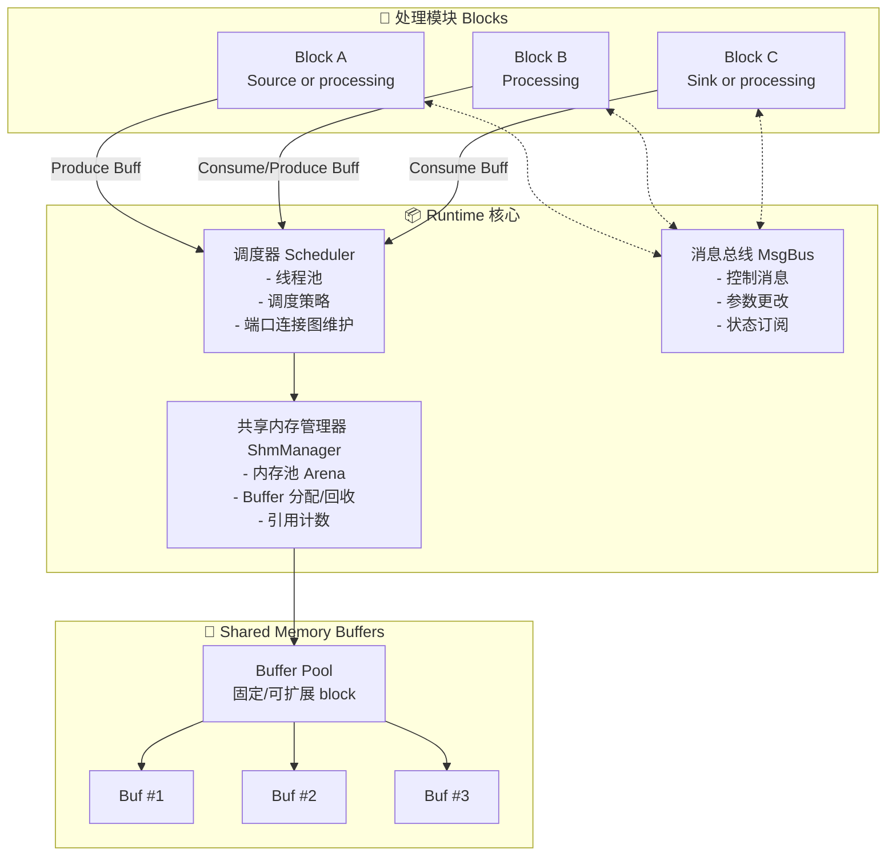

# MultiQueue-SHM 运行时架构重新设计

基于中心化流处理框架的架构设计

---

## 1. 核心架构理念

### 1.1 设计哲学

**中心化管理 + 分布式执行**

- **Runtime 核心**：统一管理资源、调度、消息
- **Block 模块**：独立的处理单元，通过端口连接
- **共享内存池**：统一的 Buffer 管理，引用计数自动回收

### 1.2 架构图



---

## 2. 核心组件设计

### 2.1 Runtime 运行时核心

Runtime 是整个系统的中枢，负责：
- 管理所有 Block 的生命周期
- 调度 Block 的执行
- 管理共享内存资源
- 提供控制和通信机制

```cpp
class Runtime {
public:
    // 单例模式
    static Runtime& instance();
    
    // 生命周期管理
    void initialize(const RuntimeConfig& config);
    void start();
    void stop();
    void shutdown();
    
    // Block 管理
    BlockId register_block(std::unique_ptr<Block> block);
    void unregister_block(BlockId id);
    
    // 连接管理
    void connect(BlockId src, PortId src_port, 
                 BlockId dst, PortId dst_port);
    void disconnect(BlockId src, PortId src_port,
                    BlockId dst, PortId dst_port);
    
    // 获取子系统
    Scheduler& scheduler() { return *scheduler_; }
    ShmManager& shm_manager() { return *shm_manager_; }
    MsgBus& msg_bus() { return *msg_bus_; }
    
private:
    Runtime();
    ~Runtime();
    
    std::unique_ptr<Scheduler> scheduler_;
    std::unique_ptr<ShmManager> shm_manager_;
    std::unique_ptr<MsgBus> msg_bus_;
    
    // Block 注册表
    std::unordered_map<BlockId, std::unique_ptr<Block>> blocks_;
    
    // 连接图
    FlowGraph flow_graph_;
};
```

---

### 2.2 Scheduler 调度器

负责调度所有 Block 的执行和数据流转。

```cpp
/**
 * @brief 调度器 - 负责线程池管理和 Block 调度
 */
class Scheduler {
public:
    Scheduler(size_t thread_count, SchedulePolicy policy);
    ~Scheduler();
    
    // 启动/停止
    void start();
    void stop();
    
    // Block 调度
    void schedule_block(BlockId block_id);
    void unschedule_block(BlockId block_id);
    
    // 数据流转接口（给 Block 调用）
    BufferPtr allocate_output_buffer(BlockId block_id, PortId port_id, size_t size);
    void publish_buffer(BlockId block_id, PortId port_id, BufferPtr buffer);
    
    BufferPtr consume_input_buffer(BlockId block_id, PortId port_id, uint32_t timeout_ms);
    
    // 连接图管理
    void add_connection(const Connection& conn);
    void remove_connection(const Connection& conn);
    
    // 策略
    enum class SchedulePolicy {
        ROUND_ROBIN,      // 轮询
        PRIORITY,         // 优先级
        WORK_STEALING     // 工作窃取
    };
    
private:
    // 工作线程
    std::vector<std::thread> worker_threads_;
    
    // 任务队列
    ThreadSafeQueue<Task> task_queue_;
    
    // 连接图（谁连接到谁）
    FlowGraph flow_graph_;
    
    // Buffer 路由表（每个输出端口对应哪些输入端口）
    std::unordered_map<OutputPort, std::vector<InputPort>> routing_table_;
    
    // 调度策略
    SchedulePolicy policy_;
    
    // 线程池
    void worker_thread_func(size_t thread_id);
    
    // 路由 Buffer
    void route_buffer(const OutputPort& src, BufferPtr buffer);
};

/**
 * @brief 连接结构
 */
struct Connection {
    BlockId src_block;
    PortId src_port;
    BlockId dst_block;
    PortId dst_port;
};

/**
 * @brief 流图 - 维护 Block 之间的连接关系
 */
class FlowGraph {
public:
    void add_edge(const Connection& conn);
    void remove_edge(const Connection& conn);
    
    std::vector<InputPort> get_downstream_ports(const OutputPort& src);
    std::vector<OutputPort> get_upstream_ports(const InputPort& dst);
    
    // 拓扑排序（用于调度优化）
    std::vector<BlockId> topological_sort();
    
private:
    // 邻接表
    std::unordered_map<OutputPort, std::vector<InputPort>> adj_list_;
};
```

---

### 2.3 ShmManager 共享内存管理器

统一管理共享内存，负责 Buffer 的分配、回收和引用计数。

```cpp
/**
 * @brief 共享内存管理器 - 内存池 + 引用计数
 */
class ShmManager {
public:
    ShmManager(const ShmConfig& config);
    ~ShmManager();
    
    // 初始化
    void initialize();
    void shutdown();
    
    // Buffer 分配/回收
    BufferPtr allocate(size_t size);
    void release(BufferPtr buffer);
    
    // 引用计数管理
    void add_ref(BufferPtr buffer);
    void remove_ref(BufferPtr buffer);
    
    // 内存池管理
    void add_pool(const std::string& name, size_t block_size, size_t block_count);
    void remove_pool(const std::string& name);
    
    // 统计信息
    ShmStats get_stats() const;
    
private:
    // 内存池集合
    std::unordered_map<std::string, std::unique_ptr<BufferPool>> pools_;
    
    // Buffer 元数据表（记录引用计数）
    std::unordered_map<BufferId, BufferMetadata> buffer_table_;
    
    // 锁
    mutable std::mutex mutex_;
};

/**
 * @brief Buffer 池 - 管理固定大小的 Buffer
 */
class BufferPool {
public:
    BufferPool(const std::string& name, 
               size_t block_size, 
               size_t block_count,
               bool expandable = false);
    
    ~BufferPool();
    
    // 分配/回收
    BufferPtr allocate();
    void deallocate(BufferPtr buffer);
    
    // 容量管理
    size_t capacity() const { return capacity_; }
    size_t available() const;
    size_t used() const { return capacity_ - available(); }
    
    // 扩展（如果允许）
    bool expand(size_t additional_count);
    
private:
    std::string name_;
    size_t block_size_;
    size_t capacity_;
    bool expandable_;
    
    // 共享内存对象
    boost::interprocess::managed_shared_memory shm_;
    
    // 空闲列表
    std::queue<BufferPtr> free_list_;
    std::mutex free_list_mutex_;
    
    // 内存 Arena
    struct Arena {
        char* base;
        size_t size;
        size_t used;
    };
    std::vector<Arena> arenas_;
};

/**
 * @brief Buffer 元数据
 */
struct BufferMetadata {
    BufferId id;
    size_t size;
    std::atomic<uint32_t> ref_count;
    uint64_t timestamp;
    BufferPool* pool;
    
    // 数据指针
    void* data;
};

/**
 * @brief Buffer 智能指针（自动引用计数）
 */
class Buffer {
public:
    Buffer(BufferId id, void* data, size_t size, ShmManager* manager);
    ~Buffer();
    
    // 禁止拷贝，允许移动
    Buffer(const Buffer&) = delete;
    Buffer& operator=(const Buffer&) = delete;
    Buffer(Buffer&&) noexcept;
    Buffer& operator=(Buffer&&) noexcept;
    
    // 数据访问
    void* data() { return data_; }
    const void* data() const { return data_; }
    size_t size() const { return size_; }
    
    // 引用计数
    uint32_t ref_count() const;
    void add_ref();
    void remove_ref();
    
    // 时间戳
    uint64_t timestamp() const { return timestamp_; }
    void set_timestamp(uint64_t ts) { timestamp_ = ts; }
    
private:
    BufferId id_;
    void* data_;
    size_t size_;
    uint64_t timestamp_;
    ShmManager* manager_;
};

using BufferPtr = std::shared_ptr<Buffer>;
```

---

### 2.4 MsgBus 消息总线

提供控制消息、参数更改、状态订阅机制。

```cpp
/**
 * @brief 消息总线 - 控制流通信
 */
class MsgBus {
public:
    MsgBus();
    ~MsgBus();
    
    // 发布消息
    void publish(const std::string& topic, const Message& msg);
    
    // 订阅消息
    SubscriptionId subscribe(const std::string& topic, MessageCallback callback);
    void unsubscribe(SubscriptionId id);
    
    // 请求-响应模式
    Response request(const std::string& endpoint, const Request& req, uint32_t timeout_ms);
    void register_handler(const std::string& endpoint, RequestHandler handler);
    
    // 广播（所有订阅者）
    void broadcast(const Message& msg);
    
private:
    // 订阅表
    std::unordered_map<std::string, std::vector<Subscription>> subscriptions_;
    
    // 请求处理器
    std::unordered_map<std::string, RequestHandler> handlers_;
    
    // 消息队列
    ThreadSafeQueue<std::pair<std::string, Message>> msg_queue_;
    
    // 处理线程
    std::thread dispatch_thread_;
    
    // 分发消息
    void dispatch_thread_func();
};

/**
 * @brief 消息类型
 */
enum class MessageType {
    CONTROL,      // 控制消息（start/stop/pause）
    PARAMETER,    // 参数更改
    STATUS,       // 状态更新
    EVENT         // 事件通知
};

/**
 * @brief 消息结构
 */
struct Message {
    MessageType type;
    std::string sender;
    std::string topic;
    std::any payload;  // 使用 std::any 存储任意类型
    uint64_t timestamp;
};

using MessageCallback = std::function<void(const Message&)>;
using RequestHandler = std::function<Response(const Request&)>;
```

---

## 3. Block 处理模块

### 3.1 Block 基类

```cpp
/**
 * @brief Block 基类 - 所有处理模块的基类
 */
class Block {
public:
    Block(const std::string& name, BlockType type);
    virtual ~Block() = default;
    
    // 生命周期
    virtual void initialize() {}
    virtual void start() {}
    virtual void stop() {}
    virtual void cleanup() {}
    
    // 工作函数（由调度器调用）
    virtual WorkResult work() = 0;
    
    // 端口管理
    void add_input_port(const std::string& name, PortConfig config);
    void add_output_port(const std::string& name, PortConfig config);
    
    // Block 信息
    BlockId id() const { return id_; }
    const std::string& name() const { return name_; }
    BlockType type() const { return type_; }
    
    // 消息处理
    virtual void handle_message(const Message& msg) {}
    
protected:
    // 数据操作接口（子类使用）
    BufferPtr get_input_buffer(const std::string& port_name, uint32_t timeout_ms = 0);
    void produce_output(const std::string& port_name, BufferPtr buffer);
    
    // 参数访问
    template<typename T>
    T get_parameter(const std::string& name);
    
    template<typename T>
    void set_parameter(const std::string& name, const T& value);
    
    // Runtime 访问
    Runtime& runtime() { return Runtime::instance(); }
    
private:
    BlockId id_;
    std::string name_;
    BlockType type_;
    
    // 端口
    std::unordered_map<std::string, InputPort> input_ports_;
    std::unordered_map<std::string, OutputPort> output_ports_;
    
    // 参数
    std::unordered_map<std::string, std::any> parameters_;
};

/**
 * @brief Block 类型
 */
enum class BlockType {
    SOURCE,       // 数据源（只有输出端口）
    SINK,         // 数据接收器（只有输入端口）
    PROCESSING    // 处理模块（有输入和输出端口）
};

/**
 * @brief 工作结果
 */
enum class WorkResult {
    OK,                 // 正常完成
    NEED_MORE_INPUT,    // 需要更多输入数据
    OUTPUT_FULL,        // 输出队列满
    DONE                // 完成（用于有限数据源）
};
```

### 3.2 Source Block 示例

```cpp
/**
 * @brief 数据源 Block
 */
class FileSourceBlock : public Block {
public:
    FileSourceBlock(const std::string& filename)
        : Block("FileSource", BlockType::SOURCE)
        , filename_(filename)
    {
        add_output_port("out", PortConfig{.buffer_size = 4096});
    }
    
    void initialize() override {
        file_.open(filename_, std::ios::binary);
        if (!file_.is_open()) {
            throw std::runtime_error("Cannot open file: " + filename_);
        }
    }
    
    WorkResult work() override {
        // 1. 从 Runtime 分配 Buffer
        auto buffer = runtime().scheduler().allocate_output_buffer(
            id(), "out", 4096
        );
        
        // 2. 读取数据到 Buffer
        file_.read(static_cast<char*>(buffer->data()), buffer->size());
        size_t bytes_read = file_.gcount();
        
        if (bytes_read == 0) {
            return WorkResult::DONE;  // 文件读完
        }
        
        // 3. 设置实际大小和时间戳
        buffer->resize(bytes_read);
        buffer->set_timestamp(get_timestamp_ns());
        
        // 4. 发布 Buffer
        produce_output("out", buffer);
        
        return WorkResult::OK;
    }
    
    void cleanup() override {
        file_.close();
    }
    
private:
    std::string filename_;
    std::ifstream file_;
};
```

### 3.3 Processing Block 示例

```cpp
/**
 * @brief 处理 Block
 */
class AmplifierBlock : public Block {
public:
    AmplifierBlock(float gain)
        : Block("Amplifier", BlockType::PROCESSING)
        , gain_(gain)
    {
        add_input_port("in", PortConfig{});
        add_output_port("out", PortConfig{.buffer_size = 4096});
        
        set_parameter("gain", gain);
    }
    
    WorkResult work() override {
        // 1. 获取输入 Buffer
        auto input = get_input_buffer("in", 100);  // 100ms 超时
        if (!input) {
            return WorkResult::NEED_MORE_INPUT;
        }
        
        // 2. 分配输出 Buffer
        auto output = runtime().scheduler().allocate_output_buffer(
            id(), "out", input->size()
        );
        
        // 3. 处理数据
        const float* in_data = static_cast<const float*>(input->data());
        float* out_data = static_cast<float*>(output->data());
        size_t count = input->size() / sizeof(float);
        
        for (size_t i = 0; i < count; ++i) {
            out_data[i] = in_data[i] * gain_;
        }
        
        // 4. 保留时间戳
        output->set_timestamp(input->timestamp());
        
        // 5. 发布输出
        produce_output("out", output);
        
        return WorkResult::OK;
    }
    
    // 参数更新
    void handle_message(const Message& msg) override {
        if (msg.type == MessageType::PARAMETER && msg.topic == "gain") {
            gain_ = std::any_cast<float>(msg.payload);
        }
    }
    
private:
    float gain_;
};
```

### 3.4 Sink Block 示例

```cpp
/**
 * @brief 接收器 Block
 */
class FileSinkBlock : public Block {
public:
    FileSinkBlock(const std::string& filename)
        : Block("FileSink", BlockType::SINK)
        , filename_(filename)
    {
        add_input_port("in", PortConfig{});
    }
    
    void initialize() override {
        file_.open(filename_, std::ios::binary);
        if (!file_.is_open()) {
            throw std::runtime_error("Cannot open file: " + filename_);
        }
    }
    
    WorkResult work() override {
        // 获取输入 Buffer
        auto input = get_input_buffer("in", 100);
        if (!input) {
            return WorkResult::NEED_MORE_INPUT;
        }
        
        // 写入文件
        file_.write(static_cast<const char*>(input->data()), input->size());
        
        return WorkResult::OK;
    }
    
    void cleanup() override {
        file_.close();
    }
    
private:
    std::string filename_;
    std::ofstream file_;
};
```

---

## 4. 使用示例

### 4.1 C++ API

```cpp
int main() {
    // 1. 初始化 Runtime
    Runtime& runtime = Runtime::instance();
    RuntimeConfig config;
    config.thread_count = 4;
    config.schedule_policy = Scheduler::SchedulePolicy::WORK_STEALING;
    runtime.initialize(config);
    
    // 2. 配置共享内存池
    runtime.shm_manager().add_pool("default", 4096, 1024);
    
    // 3. 创建 Block
    auto source = std::make_unique<FileSourceBlock>("input.dat");
    auto amp = std::make_unique<AmplifierBlock>(2.0f);
    auto sink = std::make_unique<FileSinkBlock>("output.dat");
    
    // 4. 注册 Block
    BlockId src_id = runtime.register_block(std::move(source));
    BlockId amp_id = runtime.register_block(std::move(amp));
    BlockId sink_id = runtime.register_block(std::move(sink));
    
    // 5. 连接 Block
    runtime.connect(src_id, "out", amp_id, "in");
    runtime.connect(amp_id, "out", sink_id, "in");
    
    // 6. 启动
    runtime.start();
    
    // 7. 等待完成（或运行一段时间）
    std::this_thread::sleep_for(std::chrono::seconds(10));
    
    // 8. 停止
    runtime.stop();
    runtime.shutdown();
    
    return 0;
}
```

### 4.2 Python API

```python
import multiqueue_shm as mq

# 1. 初始化 Runtime
runtime = mq.Runtime()
runtime.initialize(thread_count=4, policy='work_stealing')

# 2. 配置共享内存池
runtime.shm_manager.add_pool('default', block_size=4096, block_count=1024)

# 3. 创建 Block
source = mq.FileSource('input.dat')
amp = mq.Amplifier(gain=2.0)
sink = mq.FileSink('output.dat')

# 4. 连接
source.connect(amp, 'out', 'in')
amp.connect(sink, 'out', 'in')

# 5. 启动
runtime.start()

# 6. 运行时参数调整
amp.set_parameter('gain', 3.0)

# 7. 监控状态
def on_status(msg):
    print(f"Status: {msg}")

runtime.msg_bus.subscribe('status', on_status)

# 8. 停止
time.sleep(10)
runtime.stop()
```

---

## 5. 关键特性

### 5.1 引用计数自动管理

```cpp
// Buffer 自动通过智能指针管理引用计数
void example_multi_consumer() {
    // 生产者产生一个 Buffer
    BufferPtr buffer = shm_manager.allocate(4096);
    
    // 路由到 3 个消费者（引用计数 = 3）
    scheduler.route_buffer(output_port, buffer);
    
    // 每个消费者消费完后，引用计数自动 -1
    // 当引用计数降为 0，Buffer 自动回收到池中
}
```

### 5.2 动态连接

```cpp
// 运行时动态添加/删除连接
runtime.connect(block_a, "out", block_b, "in");

// 稍后断开
runtime.disconnect(block_a, "out", block_b, "in");

// 调度器自动更新路由表
```

### 5.3 消息总线

```cpp
// Block 订阅控制消息
runtime.msg_bus().subscribe("control", [](const Message& msg) {
    if (msg.payload == "pause") {
        // 暂停处理
    }
});

// 其他模块发布消息
Message msg{
    .type = MessageType::CONTROL,
    .sender = "GUI",
    .topic = "control",
    .payload = std::string("pause")
};
runtime.msg_bus().publish("control", msg);
```

---

## 6. 实施计划

### Phase 1: Runtime 核心（3-4天）
1. **Runtime 管理器**
   - 单例模式
   - 生命周期管理
   - Block 注册表
   
2. **ShmManager 共享内存管理器**
   - BufferPool 实现
   - 引用计数机制
   - Buffer 智能指针

3. **MsgBus 消息总线**
   - 发布-订阅机制
   - 请求-响应模式
   - 线程安全队列

### Phase 2: Scheduler 调度器（2-3天）
1. **线程池**
   - 工作线程管理
   - 任务队列

2. **FlowGraph 流图**
   - 连接管理
   - 拓扑排序
   - 路由表

3. **调度策略**
   - 轮询调度
   - 优先级调度
   - 工作窃取

### Phase 3: Block 框架（2-3天）
1. **Block 基类**
   - 端口管理
   - 参数系统
   - 消息处理

2. **内置 Block**
   - FileSource / FileSink
   - MemorySource / MemorySink
   - Amplifier / Filter 等

3. **Python Block 支持**
   - pybind11 绑定
   - 自定义 Block 注册

### Phase 4: 测试和文档（2-3天）
1. 单元测试
2. 集成测试
3. 性能测试
4. API 文档

---

## 7. 总结

### 核心优势

✅ **中心化管理**：统一的资源管理，避免分散的队列管理  
✅ **引用计数**：自动内存管理，支持多消费者  
✅ **灵活连接**：动态的 Block 连接，类似 GNU Radio  
✅ **消息总线**：解耦的控制流和数据流  
✅ **可扩展**：易于添加新的 Block 和调度策略  

### 与之前设计的区别

| 特性 | 旧设计（点对点队列） | 新设计（Runtime 框架） |
|------|---------------------|----------------------|
| **管理方式** | 分散（每个队列独立） | 中心化（Runtime 统一管理） |
| **内存管理** | 队列内部管理 | ShmManager + 引用计数 |
| **调度** | 无（Block 自己轮询） | Scheduler 统一调度 |
| **连接** | 静态（队列名） | 动态（Runtime.connect） |
| **控制** | 无 | MsgBus 消息总线 |
| **多消费者** | 每个消费者独立指针 | 引用计数自动管理 |

---

**准备开始实施吗？** 🚀

我建议先实施 **Phase 1（Runtime 核心 + ShmManager）**，这是整个框架的基础。

请确认是否开始！

